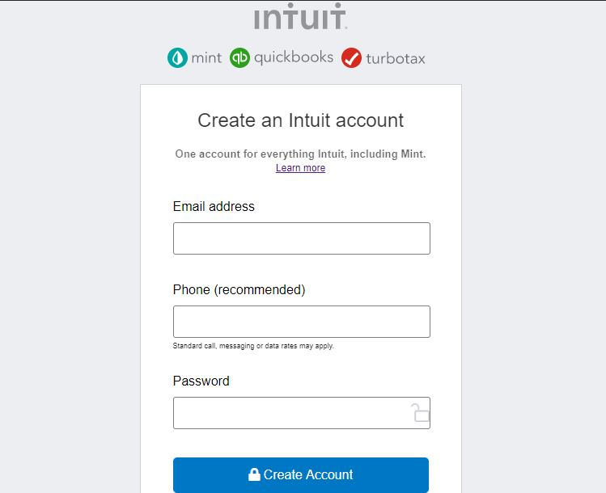

# Form Project Mint
# Working Branch

> The project is about a Mint form for users.

The project has a full description formm with a title and a field for email, phone number and a password

## Built With

- HTML
- CSS

## Live Demo

[Live Demo Link](https://deikdesign.github.io/form-project-mint/)

Prerequisites
Chrome browser
Setup
$ cd "folder location"
$ git clone https://github.com/deikdesign/form-project-mint.git
Install
Usage 
Run tests - HTML validator, w3 validation
Deployment 

Authors

👤 Author1

Github: @deikdesign
Twitter: @deikdesign
Linkedin: linkedin

👤 Author2

Github: @AlanSoto31
Twitter: @Alan95081574
Linkedin: linkedin
